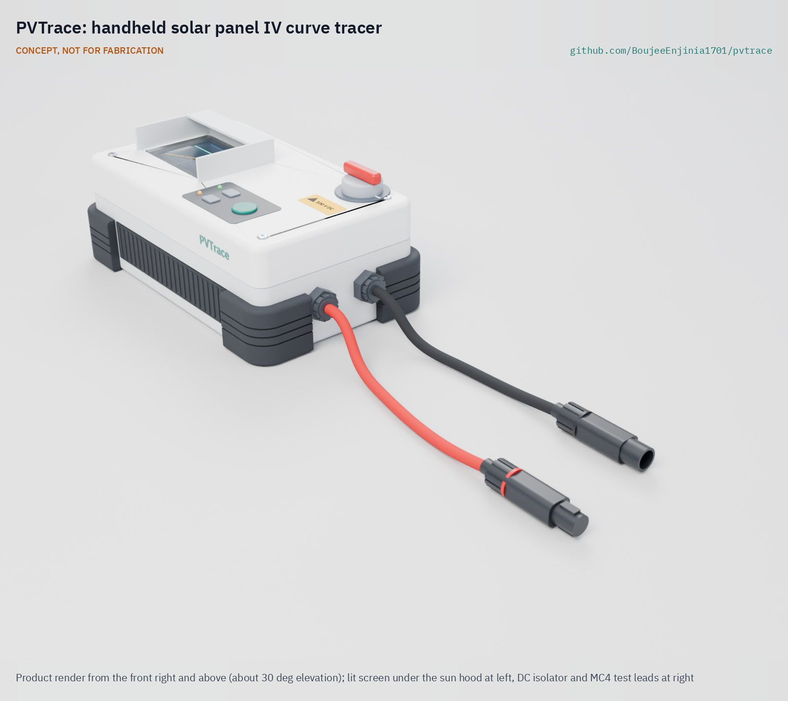
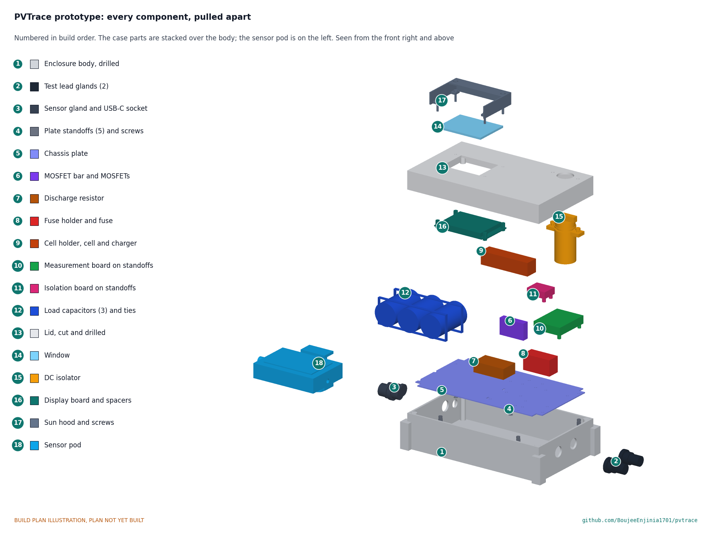

# PVTrace

     

**Area:** CleanTech · **TRL:** 3 of 9 (proof of concept on paper) · **Prototype cost:** about USD 178 (value-engineering target USD 165) · **Difficulty:** 3 of 5

A handheld solar panel IV curve tracer that sweeps a panel's current and voltage in the field, flags shading, cracked cells and degraded strings, and helps grade second-life panels.

[Exploded render](media/render-exploded.png) · [Interactive 3D model](media/viewer.html) · [Concept blueprint (PDF)](media/concept-blueprint.pdf) · [General arrangement PVT-DWG-001 (PDF)](cad/drawings/PVT-DWG-001.pdf) · [Sizing calculations](docs/04-calcs/01-sizing.md) · [Prototype build plan](docs/05-build-plan.md) · [Design decisions](docs/06-design-decisions.md) · [Review note](docs/REVIEW.md)

## Concept rationale

An IV curve is the most informative single test of a solar module: one sweep from short circuit to open circuit shows its power, and the shape of the curve points to shading, a failed bypass diode, cracked cells, corroded connections or plain wear. PVTrace uses the simplest load that can trace that curve, a capacitor bank that the module charges in a few tens of milliseconds, as proven open designs such as [IV Swinger 2](https://github.com/csatt/IV_Swinger) and [Cáceres et al. (2020)](https://doi.org/10.3390/en13174320) have done. It adds what a field user needs: a handheld case with a screen, an irradiance reference cell and temperature probe, translation to standard test conditions and a transparent grading rule.

Keeping it open and garage-buildable matters because the people who most need to grade panels, small installers, repair shops and second-life programs in lower-income markets, are the least able to buy a commercial tracer. PVTrace stays below 100 V so it remains an extra-low-voltage instrument for single modules and short strings, uses about USD 178 of common parts, and writes every sweep to an open CSV file that anyone can check or reprocess.

## Burning platform

Solar is being installed faster than ever: global capacity rose to nearly 3 TW at the end of 2025, with about 698 GW added in that year ([IEA PVPS, 2026](https://iea-pvps.org/snapshot-reports/snapshot-2026/)). Panel waste could reach 78 million tonnes by 2050 ([IRENA and IEA PVPS, 2016](https://www.irena.org/publications/2016/Jun/End-of-life-management-Solar-Photovoltaic-Panels)), yet about 70 % of modules are taken down before the end of their 25 to 30 year design life ([Huang and Long, *Nature Communications*, 2026](https://www.nature.com/articles/s41467-026-69171-z)), and field data show a median power loss of only about 0.5 % a year ([Jordan and Kurtz, 2013](https://onlinelibrary.wiley.com/doi/abs/10.1002/pip.1182)). Many removed modules could work for years more.

The obstacle is trust. Refurbished modules exported to secondary markets show 10 to 20 % power loss and inconsistent quality ([Huang and Long, 2026](https://www.nature.com/articles/s41467-026-69171-z)), and a buyer cannot see that by eye. A commercial tracer that would show it costs thousands of dollars; a single-module kit lists at $3,799 ([Transcat](https://www.transcat.com/seaward-pv210-solar-kit-389a912)).

## Where it could be used

### By industry

| Industry | Use |
| --- | --- |
| Panel reuse and recycling | Grade removed modules as A, B, C or reject before resale or recycling, with a logged curve for each |
| Solar installation and maintenance | Find the underperforming module, bypass diode or connector in a small rooftop or off-grid array |
| Off-grid and mini-grid operators | Check modules on delivery and during annual maintenance in remote sites |
| Technical and vocational training | Teach how curve shape reveals faults, with an instrument students can build and repair |
| Research | Log low-cost outdoor curves over months for degradation studies |
| Used-panel trade and consumer protection | Let a buyer or inspector check a seller's power claim on the spot |

### By country or region

| Country or region | Why it matters there |
| --- | --- |
| Sub-Saharan Africa and the Middle East | Projected PV waste of about 1.6 and 1.7 million tonnes by 2050, over 90 % from imported modules, many of them second-hand ([Huang and Long, 2026](https://www.nature.com/articles/s41467-026-69171-z)). |
| India | Cumulative solar waste could reach up to 600 kilotonnes by 2030 ([CEEW, 2024](https://www.ceew.in/press-releases/robust-recycling-increasing-solar-waste-critical-indias-energy-security-ceew)); a large repair and resale trade can use cheap grading. |
| Australia | World-leading rooftop solar per person and about 280,000 tonnes of end-of-life panels by the end of 2025; researchers propose a resale certification with simple grades ([UniSA, 2025](https://unisa.edu.au/media-centre/Releases/2025/old-solar-panels-can-power-new-future/)). |
| United States | Up to 1 million tons of panel waste expected by 2030 and up to 10 million tons by 2050 ([US EPA](https://www.epa.gov/hw/end-life-solar-panels-regulations-and-management)); reuse programs need test data per module. |
| European Union | PV panels are category 4 equipment under the WEEE Directive ([Directive 2012/19/EU, Annex I and II](https://eur-lex.europa.eu/legal-content/EN/TXT/HTML/?uri=CELEX:32012L0019)), so a logged test per module helps decide between reuse and recycling. |

## What sparked the idea

The starting point was the hailstorm of March 15, 2024, which damaged thousands of modules at the 350 MW Fighting Jays solar farm in Fort Bend County, Texas ([*Newsweek*, 2024](https://www.newsweek.com/thousands-solar-panels-texas-destroyed-hailstorm-1883546); [VDE Americas, 2025](https://www.vde.com/en/vde-americas/newsroom/250114-reevaluating-fighting-jays)). Shattered glass is easy to see after a storm like that, but a module with intact glass can still carry cracked cells, and every module that comes off a damaged array needs a call: back on the rack, resale, or recycling. A glance or a single voltage reading cannot make that call; an IV curve taken at the module, with the result logged, can. PVTrace is sized for that job: one module or a short string at a time, on the ground next to the array or at a reuse yard.

## Problem

Installers and reuse programs judge panels by eye or by a single voltage reading, missing faults that an IV curve shows at once. Commercial tracers cost thousands of dollars.

Full problem statement: [docs/01-problem.md](docs/01-problem.md)

## Concept

A handheld tracer for single modules and short strings up to 100 V and 20 A. The module charges a 6.6 mF capacitor bank in about 20 to 68 ms (calculated) while the tracer samples 400 or more voltage and current pairs. A reference cell and a probe on the module back give irradiance and temperature, so the curve can be translated to standard test conditions (IEC 60891). A digital isolator separates the measurement side from the controller and USB port. The tracer flags shading or bypass diode steps, high series resistance, low shunt resistance and current loss, grades second-life modules against nameplate, and saves every sweep as CSV. A printed sun hood shades the display. Calculated mass is about 1.49 kg and battery life about 10 h. Value-engineering target: USD 165; estimated cost of the constructable design: USD 178 (USD 13 over the target).

Full design precis: [docs/02-concept.md](docs/02-concept.md) · Requirements: [docs/03-requirements.md](docs/03-requirements.md) · Sizing: [docs/04-calcs/01-sizing.md](docs/04-calcs/01-sizing.md) · Decisions: [docs/decisions/0001-trl2-review-decisions.md](docs/decisions/0001-trl2-review-decisions.md), [docs/decisions/0002-recommendations-accepted.md](docs/decisions/0002-recommendations-accepted.md), [docs/decisions/0003-design-for-construction.md](docs/decisions/0003-design-for-construction.md)

Not met on paper at TRL 3: the 20 ms minimum sweep time for high-current modules when the capacitors are at the low end of their tolerance, sunlight readability of the display (a sun hood is now fitted, but readability cannot be shown until a field check), and insulation screening of second-life modules (out of scope; use an insulation tester alongside). The estimated cost, USD 178, is USD 13 over the USD 165 value-engineering target; savings worth trying are in the [design decisions register](docs/06-design-decisions.md). Details are in the [review note](docs/REVIEW.md).

## Key components

- Capacitive load: 3 x 2200 µF 160 V capacitors (6.6 mF), load and discharge MOSFETs, 22 ohm 50 W dump resistor
- Measurement board: 4 milliohm shunt, current-sense amplifier, voltage divider, dual 12-bit ADC
- Isolation barrier: digital isolator and isolated DC-DC converter between the measurement side and the controller
- Reference cell and module temperature probe in a clip-on sensor pod
- ESP32 controller with 2.8 in display, microSD logging and Wi-Fi export
- 20 A DC fuse, 2-pole DC isolator and MC4 test leads
- Protected 18650 Li-ion cell with USB-C charging and a temperature cut-off
- IP54 light grey handheld case, about 220 x 130 x 80 mm, with a printed display sun hood, a polycarbonate chassis plate inside and a USB-C charging socket

The priced bill of materials is in [bom/bom.csv](bom/bom.csv); the parametric model is `cad/src/model.py`, with STEP and STL exports in `cad/step` and `cad/stl`.

## Building the prototype

The prototype build plan ([docs/05-build-plan.md](docs/05-build-plan.md)) shows how to make and fit every component, with a making sketch for each made part, close-ups of the joints and a picture for each of the 12 assembly steps. Every part in the case body is screwed to a clear polycarbonate chassis plate that is built on the bench and lowered in as one unit; the display board hangs under the lid on the same four screws that hold the sun hood. Eight parts are made with hand tools and a 3D printer; the rest are bought. Making the concept buildable changed no function and is recorded in [PVT-DDR-003](docs/decisions/0003-design-for-construction.md). It is a plan only: building and testing to it is TRL 4 work.

## Safety

> Solar panels produce dangerous DC voltage whenever light falls on them and cannot be switched off. Rate leads and switching for the full voltage and current, mate and unmate MC4 connectors only with the isolator open, and never break a DC circuit under load. PVTrace is limited to 100 V DC; never connect it to a longer string. The load capacitors store up to 33 J and must be discharged before the case is opened. The instrument contains a Li-ion cell; charge it in shade on a non-flammable surface and not while connected to a module. In full sun the case can get hot inside; keep it in shade between sweeps. Handle modules with gloves: frames are sharp and broken glass can cut.

## Repository layout

| Folder | Contents |
| --- | --- |
| `docs/` | Problem, concept, requirements, calculations, prototype build plan and design decisions |
| `cad/src/` | build123d Python source, the source of truth for all geometry |
| `cad/step/`, `cad/stl/` | Exported models for FreeCAD, other CAD tools and printing |
| `cad/drawings/` | 2D sketches and dimensioned drawings |
| `bom/` | Bill of materials |
| `electronics/` | KiCad schematics and PCB layouts |
| `firmware/` | Microcontroller code |
| `media/` | Renders, perspectives and photos |
| `build-log/` | Dated prototyping notes |

## Documentation

Controlled documents follow the portfolio [documentation standard](.kit/STANDARDS.md). Each carries a document ID (PVT-PRC-001 for the precis), a version and a revision history. Branded PDFs are built with `python .kit/render.py` and attached to GitHub Releases when a document is tagged, for example `PVT-PRC-001/v1.0`.

## Credits

Designed by Amish Chadha. See [CONTRIBUTORS.md](CONTRIBUTORS.md) for roles. To cite this design, use [CITATION.cff](CITATION.cff) (GitHub shows it as "Cite this repository").

AI assistance (Claude) was used to accelerate concept renders, prototype documentation and first-pass sizing calculations. Design direction and all decisions are Amish Chadha's, recorded in this repository's decision records (`docs/decisions/`).

## Licenses

- **Hardware** (CAD, drawings, BOM, electronics): [CERN-OHL-S v2](LICENSE)
- **Software** (firmware, scripts, notebooks): [MIT](LICENSE-SOFTWARE)

A project of the [Design Molecule](https://designmolecule.com) lab.
