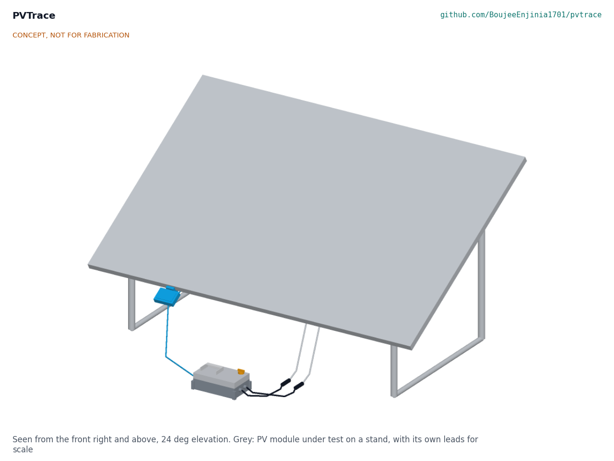
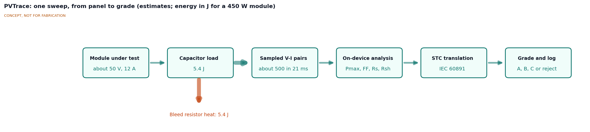
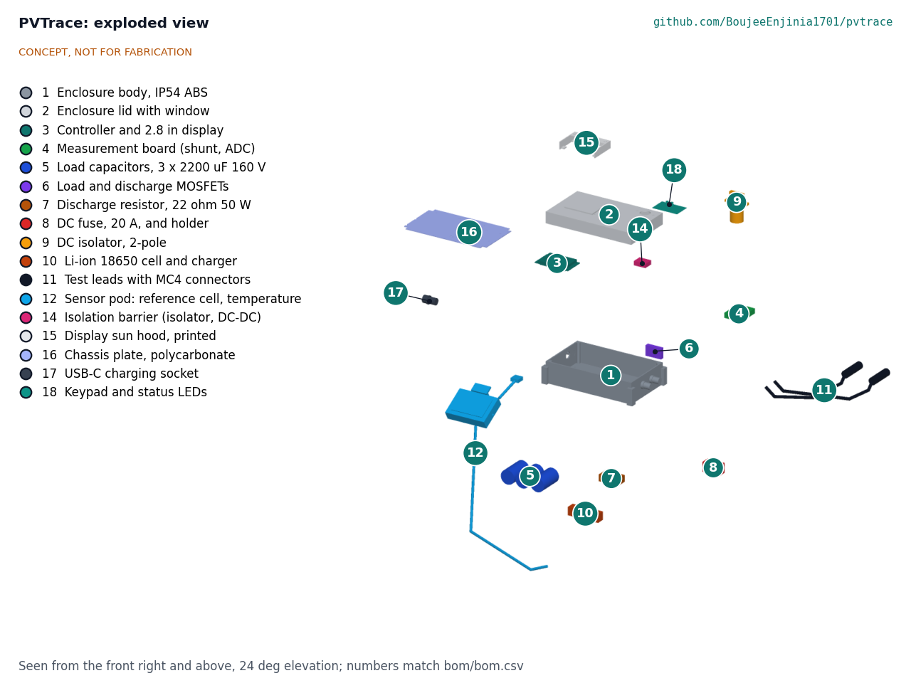
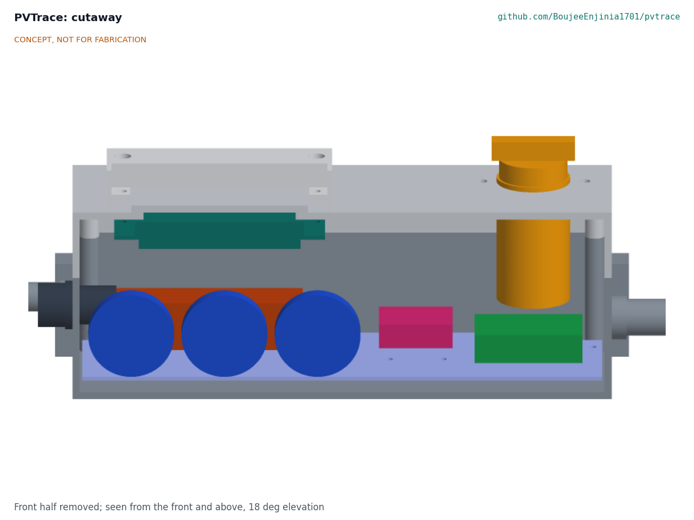

# PVTrace design precis

## Summary

PVTrace is a handheld, battery-powered IV curve tracer for single PV modules and short strings up to 100 V and 20 A. It sweeps the module from short circuit to open circuit by letting it charge a 6.6 mF capacitor bank in about 20 to 68 ms, samples several hundred voltage and current pairs, reads irradiance from a reference cell and temperature from a probe on the module back, translates the curve to standard test conditions (STC) and shows fault flags and a second-life grade on its screen. A digital isolator and an isolated DC-DC converter separate the measurement side from the controller and USB port. Every sweep is saved as an open CSV file. Value-engineering target: USD 165. Estimated cost of the constructable design: USD 178 (USD 13 over the target). The capacitive load follows proven open designs (IV Swinger 2; Cáceres et al., 2020, see PVT-PRB-001); what is new is a standalone field instrument with sensing, translation and a transparent grading rule.

The design choices in this precis were decided by Amish on 2026-09-25 (go with recommendation; PVT-DDR-001 and PVT-DDR-002). Sizing is in PVT-CAL-001; the general arrangement is drawing PVT-DWG-001. The design was made constructable on 2026-10-01 (PVT-DDR-003): every part now has a fixing, and the prototype build plan PVT-BLD-001 shows how to make and fit each one.

Figure 1. PVTrace in use (concept massing model; grey module and stand for scale).

## How it works

1. **Connect.** The user mates the two MC4 test leads to the module's leads with the DC isolator open, clips the sensor pod to the module's lower frame so the reference cell lies in the module plane, and presses the probe onto the module back.
2. **Check.** With the isolator closed and the load switch off, the controller reads open-circuit voltage through the divider. It refuses to continue if the polarity is reversed or Voc exceeds 100 V.
3. **Sweep.** The load MOSFET closes onto the discharged capacitor bank. The module first delivers close to its short-circuit current, then the capacitor voltage rises through the knee to Voc. The ADC on the isolated measurement side samples voltage and current in pairs throughout and sends them to the controller through the digital isolator. The capacitor current decays toward zero near Voc; firmware keeps the MOSFET closed until the current is below 0.5 A, so it never opens a loaded DC circuit.
4. **Dump.** The load MOSFET opens and a second MOSFET discharges the bank through a 22 ohm aluminium-clad resistor, below 30 V in about 0.2 s. A permanent 10 kohm bleed resistor empties the bank if the controller fails.
5. **Analyze.** Firmware extracts Isc, Voc, Pmax, Vmp, Imp and fill factor, estimates series and shunt resistance from the slopes near Voc and Isc, and looks for steps that show bypass diode conduction.
6. **Translate and grade.** Using irradiance, module temperature and the datasheet coefficients the user selects, it translates the curve to STC with IEC 60891 procedure 1 and compares Pmax with nameplate to give a grade.
7. **Log.** The sweep, conditions, flags and grade go to microSD and can be exported by USB or to a phone over Wi-Fi.

Figure 2. Measurement and energy flow for one sweep (estimates).

## Main components

Numbers match `bom/bom.csv` and the exploded view (Figure 3).

Table 1. Main components

| No. | Component | Role |
| --- | --- | --- |
| 1 | Enclosure body, IP54 ABS handheld case about 220 x 130 x 80 mm, light grey, with rubber corner bumpers and three cable glands | Houses and protects the electronics |
| 2 | Enclosure lid with a 72 x 54 mm polycarbonate window bonded over a 62 x 46 mm opening | Closes the case; window for the display |
| 3 | Controller and 2.8 in display board (ESP32 class, microSD) | Runs the sweep, analysis, grading, logging, Wi-Fi export |
| 4 | Measurement board: 4 milliohm shunt, current-sense amplifier (INA240 class), voltage divider, dual 12-bit ADC with precision reference, MOSFET gate driver supply | Measures V and I during the sweep, on the PV side of the isolation barrier |
| 5 | Load capacitors, 3 x 2200 µF 160 V electrolytic (6.6 mF) | The sweep load |
| 6 | Load and discharge MOSFETs (150 V class) with gate driver on an aluminium bar | Connects and empties the load |
| 7 | Discharge resistor, 22 ohm 50 W aluminium clad, plus 10 kohm 3 W passive bleed | Absorbs the stored energy |
| 8 | DC fuse, 20 A gPV 10 x 38 mm, in a DC-rated holder | Protects the leads and switch from a fault |
| 9 | DC isolator, 2-pole, rated 20 A at 250 V DC or more | Separates the instrument from the module when not sweeping |
| 10 | Li-ion 18650 protected cell, holder, USB-C charger with temperature cut-off, 5 V boost and protection | Powers the controller, display and, through item 14, the measurement side |
| 11 | Test leads, 2 x 1 m, 4 mm² double-insulated PV cable with MC4 connectors | Connects to the module |
| 12 | Sensor pod: reference cell and shaded temperature probe, frame clip, 3 m cable | Measures irradiance and module temperature |
| 13 | Hardware and consumables (not modeled) | Screws, standoffs, wire, gaskets |
| 14 | Isolation barrier: 4-channel digital isolator and 1 W isolated DC-DC converter | Separates the PV-side measurement board from the controller, USB port and battery |
| 15 | Display sun hood, printed light grey PETG, 92 x 64 x 18 mm, three walls, a 20 mm roof lip and four screw tabs, open toward the user | Shades the display window to improve contrast in sun (PVT-DDR-002 item 12); its screws also hold the display board |
| 16 | Chassis plate, 1.5 mm polycarbonate on five standoffs | Carries every part in the case body; lifts out as one unit (PVT-DDR-003) |
| 17 | USB-C charging socket, IP65 with cap, in the left end | Charges the cell with the case closed (R14; PVT-DDR-003) |

Figure 3. Exploded view; callouts match Table 1.

Figure 4. Cutaway looking toward the back wall: the three capacitors (blue) in front of the battery (orange), isolation board (pink) and measurement board (green) on the floor, DC isolator (amber) through the lid, controller and display (teal) under the window.

## Key numbers

All values are calculated in PVT-CAL-001 and are estimates for a paper design.

Table 2. Sweep with a 6.6 mF load (single-diode model, time from 0 V to 99 % of Voc)

| Case | Voc (V) | Isc (A) | Sweep, nominal (ms) | Sweep, -20 % capacitance (ms) | Energy stored (J) |
| --- | --- | --- | --- | --- | --- |
| 36-cell 100 W | 22.0 | 6.0 | 28.9 | 23.1 | 1.6 |
| 108 half-cell 410 W (high current) | 37.5 | 13.9 | 20.5 | 16.4 | 4.5 |
| 144 half-cell 450 W (reference) | 49.5 | 11.6 | 32.2 | 25.8 | 7.9 |
| 2 x 60-cell 250 W in series (high voltage) | 75.2 | 8.9 | 67.5 | 54.0 | 18.3 |
| Rating limit | 100 | 20 | 37.7 | 30.1 | 33 at 100 V |

Assumptions: datasheet-class values; 56.6 mΩ loop resistance; module capacitance ignored (see PVT-CAL-001 section 2).

- **Sweep time.** The high-current case meets the 20 ms lower bound of R3 at nominal capacitance (20.5 ms) but not at -20 % tolerance (16.4 ms). R3 is not met with capacitors as bought. Amish decided on 2026-10-02 (PVT-DEC-001, item 4) that each capacitor is measured at build and a set giving at least 6.4 mF is selected, which holds about 20 ms; the 20 ms bound is relaxed later only if TOPCon and HJT capacitance data justify it.
- **Samples.** At 25,000 pairs per second a sweep yields 410 pairs or more (R4). Firmware interpolates each voltage to the time of its current sample, which removes up to 0.16 % error in Pmax.
- **Resolution.** Voltage full scale 109.1 V, 26.6 mV per count; current full scale 20.48 A, 5.00 mA per count. After calibration about ±0.2 % of reading ±0.03 % of full scale (R5).
- **Discharge.** 22 ohm with 6.6 mF gives a 145 ms time constant: 100 V falls below 30 V in 0.21 s with +20 % capacitance. Peak dump power is 455 W for milliseconds; at one sweep every 5 s the average is 1.6 W for the reference module and 6.6 W at 100 V. The 10 kohm bleed takes 100 V below 60 V in 40 s and draws 10 mA at 100 V, which firmware subtracts.
- **Opening current.** At 99 % of Voc the module still delivers up to 2.5 A, so the load switch stays closed up to 6 ms longer until the current is below 0.5 A.
- **Battery.** 0.85 W at 5 V (controller, display and isolated side), 0.94 W from the cell: about 10.3 h from a 3,000 mAh 18650.
- **Heat.** In full sun at 45 °C ambient the inside of a light grey case reaches about 56 °C, a dark case about 73 °C. The case is therefore light grey, the charger has a temperature cut-off, a printed hood shades the display, and the tracer should stay in shade between sweeps.
- **STC uncertainty.** Root-sum-square ±3.7 to ±5.4 %; R8 (±5 %) needs a reference cell calibrated within ±4.5 %.
- **Mass.** About 1.49 kg with leads, sensor pod, sun hood and chassis plate (R12 met, about 14 g to spare).
- **Cost.** Value-engineering target: USD 165 (`budget_usd`, a hypothetical control target, not a limit). Estimated cost of the constructable design: USD 178 (USD 13 over the target; see `bom/bom.csv`).

## Fault flags and grading (draft rules)

Table 3. Draft fault rules

| Flag | Curve symptom | Draft rule |
| --- | --- | --- |
| Shading or bypass diode active | Step or plateau in the curve | Local minimum in dI/dV, or current drop of 10 % or more within 3 % of Voc, below Vmp |
| High series resistance | Shallow slope near Voc | Estimated Rs more than 1.5 times the model value for the module type |
| Low shunt resistance | Steep slope near Isc | Estimated Rsh below 10 times Vmp/Imp |
| Current deficit (soiling, degradation, cracks) | Isc low against irradiance | Isc at STC below 90 % of nameplate |
| Missing substring | Voc about one third low | Voc at STC below 70 % of nameplate |

Grades from STC Pmax against nameplate (decided by Amish, PVT-DDR-001 item 8): A 90 % or more, B 80 to 90 %, C 70 to 80 %, reject below 70 % or with any safety defect found by visual inspection (broken glass, burnt junction box, delaminated backsheet). Grades are indicative; they are not a certification.

## Key design choices

Items 1 to 8 were decided by Amish on 2026-09-25: go with recommendation (PVT-DDR-001, PVT-DDR-002). The options considered are in PVT-PRC-001 v0.2 and `docs/REVIEW.md`.

1. **Load type.** Capacitive load: simple, fast, low heat, proven in open designs.
2. **Voltage and current rating.** 100 V, 20 A: single modules and two in series, below the 120 V DC extra-low-voltage limit. Two 450 W modules in series exceed it when cold and are refused.
3. **Load capacitance.** 6.6 mF with three capacitors. It meets R3 at nominal capacitance but not at -20 % tolerance; the capacitors are measured at build and a set of at least 6.4 mF is selected (decided 2026-10-02, PVT-DEC-001 item 4).
4. **Isolation of the controller from the PV side.** Option B: a digital isolator and isolated DC-DC converter between the measurement board and the controller, so a laptop on USB is not tied to PV potential.
5. **Display and interface.** 2.8 in TFT plus phone export. A printed sun hood is fitted (item 12, decided); readability in direct sun is still not shown on paper (R13).
6. **Irradiance sensing.** A small reference cell measured at short circuit and calibrated once against a pyranometer.
7. **Controller.** ESP32 display board.
8. **Grade thresholds.** As in the grading rules above, held in an editable table and still to be agreed with a second-life partner; the first candidate type to approach is a refurbisher or recycler that tests used modules in volume (decided 2026-10-02, PVT-DEC-001 item 5).

Also decided by Amish on 2026-09-25: the $165 budget (a value-engineering target since 2026-10-01), the sun hood and the 220 x 130 x 80 mm case (items 9, 12 and 13). Decided by Amish on 2026-10-02 (PVT-DEC-001): the first co-design partner type (item 10) and the R3 shortfall at tolerance (item 11, capacitor selection at build). Also decided then: the pod is read on the controller side of the isolation barrier, the 14 g mass margin is accepted, and a keypad and status LEDs are added for input, since the display's touch screen sits behind the bonded window.

## Links to other lab projects

- **CellCheck** grades salvaged lithium cells for rebuilt packs; PVTrace applies the same measure, grade and log approach to modules. A shared grade-label and CSV format would help both.
- **CalRig** can check PVTrace's module temperature probe from 10 to 40 °C (its reference is ±0.2 °C). It does not reach module temperatures of 60 °C or more and does not provide irradiance references, so the reference cell needs a separate calibration route.
- PVTrace does not use a SwapCell pack; a single 18650 cell is enough.

## Safety

> **Safety:** PV modules are live whenever light falls on them. The tracer handles up to 100 V DC and 20 A, which can cause burns and sustained DC arcs. Mate and unmate MC4 connectors only with the isolator open and never under load. Use brand-matched MC4 connectors from one maker; mixed brands can overheat.

> **Safety:** The load capacitors store up to 33 J at 100 V. Active and passive discharge paths are required; treat the capacitors as charged until the display reads below 30 V, and never open the case with the leads connected.

> **Safety:** The discharge resistor and MOSFET bar get hot under repeated sweeps; firmware limits the sweep rate to one every 5 s.

> **Safety:** The instrument contains a Li-ion cell. Use a protected cell, charge it only with the isolator open, in shade, on a non-flammable surface, within 0 to 45 °C, and never leave it charging unattended in a hot vehicle. In full sun the inside of the case can pass 45 °C (PVT-CAL-001); the charger's temperature cut-off must not be bypassed.

> **Safety:** Handling modules involves sharp frame edges, heavy glass (about 20 to 25 kg for large modules) and work at height on rooftops. Broken modules can cut and may still be live. Wear gloves and eye protection, and follow local rules for work at height.

> **Safety:** Do not connect PVTrace to a string of an installed grid-connected system unless the owner has isolated it from the inverter and the string Voc is below 100 V.

## Open questions

- [ ] Is 20 ms the right lower bound on sweep time for TOPCon and HJT modules, or is a longer sweep needed? Until capacitance data justify a change, the bound stays and the capacitor bank is selected to at least 6.4 mF (PVT-DEC-001, item 4).
- [x] How to capture true Isc: extrapolate from the first samples, which start 1 to 2 % of Voc above zero (PVT-CAL-001); no negative pre-charge.
- [ ] Which reference cell and calibration route give ±3 % or better at low cost?
- [ ] Is a commodity TFT with the sun hood readable in sun, or is a transflective display needed? (Field check, TRL 4.)
- [ ] What grade label format would buyers and a certification scheme accept?
- [ ] Should the firmware support two modules in parallel (current to 20 A at lower voltage) as well as in series?
