# PVTrace prototype build plan

**Plan, not yet built.** How to build the first proof-of-concept prototype, component by component. Building and testing to it is TRL 4 work. Decisions still to be made are kept in the design decisions register ([docs/06-design-decisions.md](06-design-decisions.md)), not here.

## 1. What you are building

*Figure 1. Every component pulled apart and numbered in build order. The case parts are stacked over the body; the sensor pod, 18, is on the left.*

The prototype is one handheld PVTrace: a light grey plastic case, 220 x 130 x 80 mm, with two test leads leaving its right end, a DC isolator knob and a display under a small sun hood on its lid, and a sensor pod on a 3 m cable that clips to the frame of the module under test. Inside, a clear plastic chassis plate carries every part in the body: three large capacitors that form the sweep load, a bar with two switching transistors (MOSFETs), a discharge resistor, a fuse, a cell holder with its charger, and two hand-wired boards that measure the module and keep it electrically separate from the controller side. Figure 1 shows the 18 components in the order you make or fit them. Eight are made in a small workshop: the drilled case body, the chassis plate, the MOSFET bar, the cut and drilled lid, the window, and three 3D prints (the sun hood, the pod housing and the pod clip). Everything else is bought and fitted. The work is drilling a plastic case, cutting and drilling plastic sheet, drilling and tapping one aluminium bar, three prints, and wiring bought modules and perfboard. The parts cost about $178 from the bill of materials.

> **Safety:** PVTrace connects to solar modules that are live whenever light falls on them, at up to 100 V DC and 20 A, and its capacitors store up to 33 J. Build and check it on a bench supply first; connect it to a module only at stop S5 in section 6, with the isolator open while connecting, and never open the case with the leads connected. Treat the capacitors as charged until the display reads below 30 V and a meter confirms it. The cell is lithium-ion: keep it out of its holder until stop S1, and charge it only in shade, on a non-flammable surface, never unattended.

## 2. What changed to make it buildable

The concept showed what the tracer does; many of its parts had no fixing or could not be fitted as drawn. Each change below keeps what the tracer does, and all of them are recorded in decision record PVT-DDR-003, open for Amish's review.

*Table 1. Changes from the concept.*

| Component | The concept had | The buildable design has | Why |
| --- | --- | --- | --- |
| Cable glands | Drawn outside the end walls, no holes, no locknuts | Holes through the walls and locknuts inside; the lead glands 2 mm closer together, the sensor gland 10 mm further back (Figures 4 and 5) | A spanner reaches every nut; the nuts clear the fuse holder |
| Window | The same size as the lid opening, nothing to bond to | A 72 x 54 mm window bonded on top of the lid over a 62 x 46 mm opening (Figure 18) | A 4 to 5 mm bond land seals the opening |
| Sun hood | No fixing; walls too thin for the screws | Four screw tabs inside the side walls; 4 mm wider; screwdriver holes in the roof lip (Figures 19 and 21) | The hood screws down to the lid |
| Display board | Floating under the lid, drawn larger than the real board | The real 86 x 50 mm board on four spacers, held by the hood's four screws (Figures 20 and 21) | One set of screws holds the hood and the board |
| Parts in the body | Standing on the floor with no fixing | A clear chassis plate on five standoffs, every part screwed to it (Figures 6 to 8) | Five floor holes only; the fit-out is built on the bench and lowered in |
| Capacitors | Lying loose, one overlapping a lid screw pillar | Moved clear of the pillars; a bed of silicone and two cable ties through the plate (Figure 12) | Held down without a printed cradle |
| MOSFETs, isolator, holders | No fixings | A tapped aluminium bar for the MOSFETs on insulating pads; the isolator's own flange and screws; two screws for each holder (Figures 10 and 17) | Every fixing can be fitted with hand tools |
| Measurement board | On the floor, clear of nothing once raised | Turned 90 degrees on standoffs (Figure 7) | Clears the gland nuts, the MOSFET bar and the isolator body |
| USB-C charging | No port through the case | An IP65 USB-C socket with a cap in the left end (Figure 5) | Charges with the case closed and the isolator open |
| Sensor pod | A solid block for a clip, no cable entry | A C-clip with a thumb screw, screwed to the housing; a cable gland (Figures 23 and 24) | Grips frames 30 to 40 mm deep with the cell parallel to the glass |

## 3. Making the components

Make and check each component before the assembly step that needs it. Sizes are in millimetres. The **front** is the long side of the case toward the user, where the sun hood opens; the **left end** carries the sensor gland and the USB-C socket and the **right end** the test leads. Workshop tolerance is 0.5 mm unless a step says otherwise; drawings do not carry tolerances before TRL 4.

### 3.1 Enclosure body, drilled, with its glands and USB-C socket

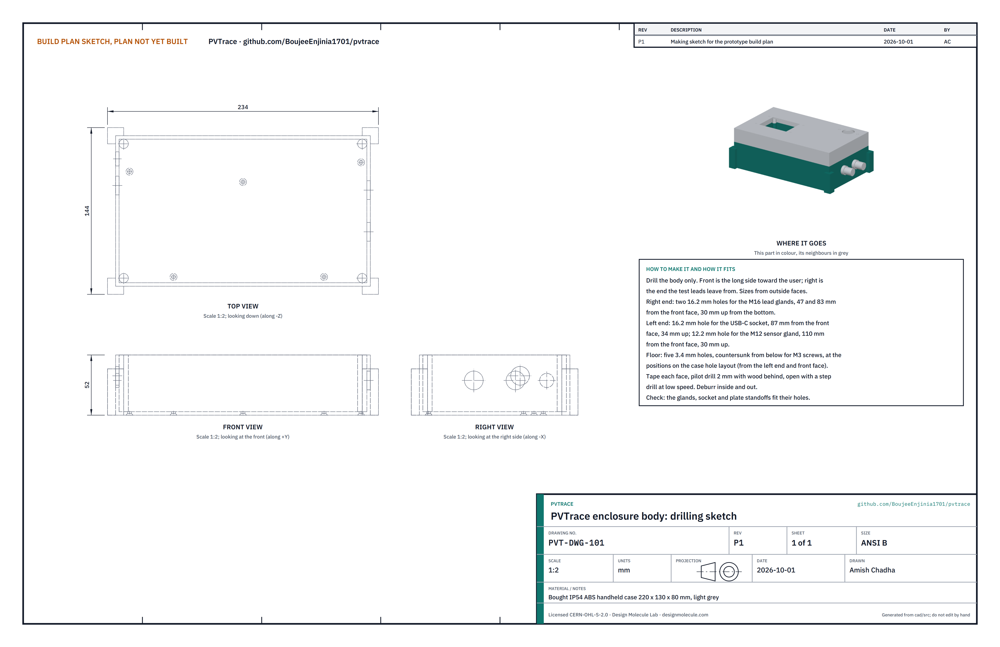

*Figure 2. Enclosure body drilling sketch (PVT-DWG-101).*

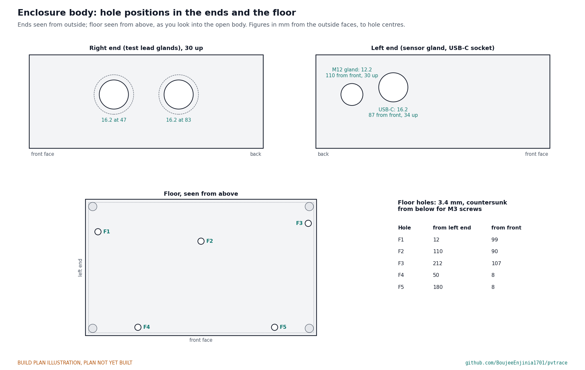

*Figure 3. Every hole in the two ends and the floor, measured from the outside faces.*

**What it is and what it is made from.** A bought IP54 handheld case in light grey ABS, 220 x 130 x 80 mm, with rubber corner bumpers, a gasketed lid that screws into four moulded corner pillars, and three cable glands. Nine holes are drilled in the body.

**How to make it.**

1. Cover the ends and floor with masking tape. Mark the holes from Figure 3, measuring from the outside faces.
2. Right end: two holes for the M16 lead glands, 47 and 83 mm from the front face, 30 mm up from the bottom.
3. Left end: one hole for the USB-C socket, 87 mm from the front face and 34 mm up; one hole for the M12 sensor gland, 110 mm from the front face and 30 mm up.
4. Floor: five holes for the chassis plate standoffs, at F1 to F5 in Figure 3. Countersink each from below for an M3 countersunk screw.
5. Put a block of wood behind each face. Pilot drill every hole 2 mm at low speed, then open with a step drill: 16.2 mm for the two lead glands and the USB-C socket, 12.2 mm for the sensor gland, 3.4 mm in the floor. Check the gland and socket sizes on their datasheets before the last step.
6. Deburr inside and out, peel the tape and clean with soap and water.

**How it fits the parts next to it.**

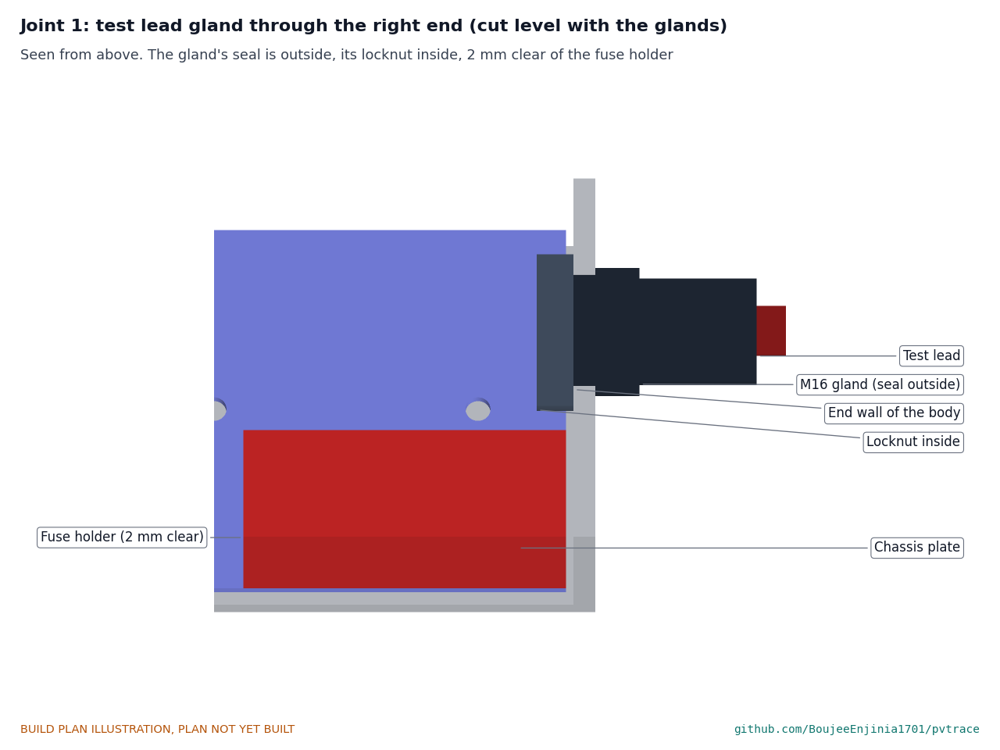

*Figure 4. The gland's seal is outside and its locknut inside; the nut is 2 mm clear of the fuse holder.*

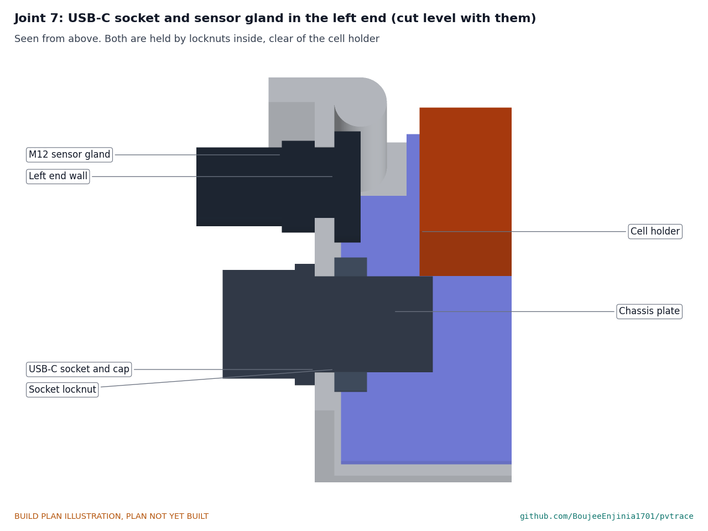

*Figure 5. The socket and the sensor gland, each held by a locknut inside, clear of the cell holder.*

Each gland and the socket go in from outside with their sealing washers outside and their locknuts inside, hand tight plus a quarter turn (step 2). The chassis plate sits 1 mm in from every wall on five standoffs screwed up through the floor (Figure 6).

**Check before moving on.** Each gland and the socket seat flat on their washers; no crack runs out from any hole under a bright lamp; the five floor screws sit flush or just below the floor.

### 3.2 Chassis plate

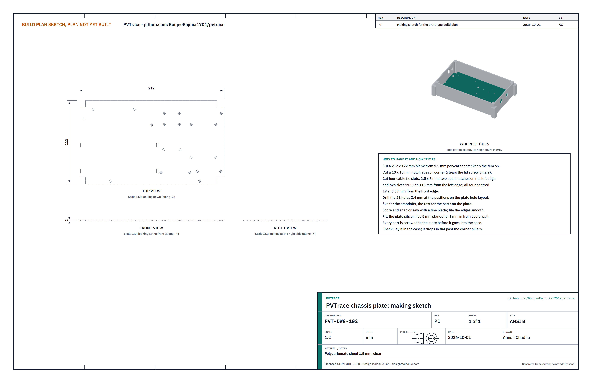

*Figure 6. Chassis plate making sketch (PVT-DWG-102).*

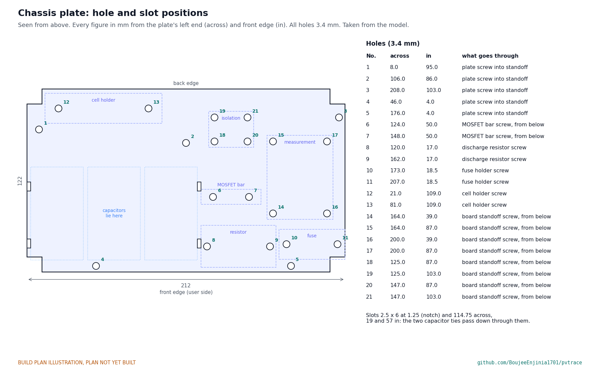

*Figure 7. All 21 holes and the four tie slots, with the footprint of each part that sits on the plate.*

**What it is and what it is made from.** The flat plate that carries every part in the body and lifts out as one unit. Clear polycarbonate sheet 1.5 mm, an insulator.

**How to make it.**

1. Cut a 212 x 122 mm blank; keep the protective film on.
2. Cut a 10 x 10 mm notch at each corner; these clear the lid screw pillars.
3. Cut the four 2.5 x 6 mm tie slots: two as open notches on the left edge and two 113.5 to 116 mm from the left edge, all centred 19 and 57 mm from the front edge.
4. Mark the 21 holes from the table in Figure 7, measured from the left edge and the front edge. Drill each 3.4 mm.
5. File every edge smooth and peel the film.

**How it fits the parts next to it.**

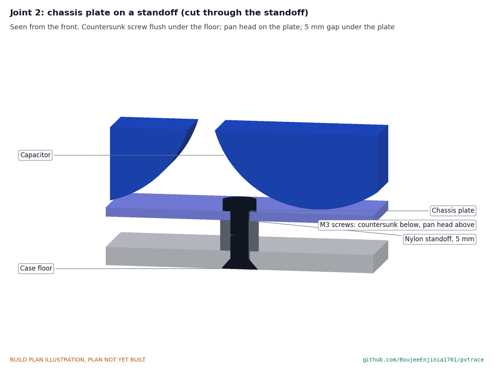

*Figure 8. A countersunk M3 screw comes up through the floor into a 5 mm nylon standoff; a pan-head M3 screw holds the plate on top. The gap under the plate leaves room for the nuts and ties.*

The plate sits on the five standoffs, 5 mm above the floor. Every part on it is fixed by M3 screws through its holes, with the nuts or screw heads in the gap underneath. All five plate screws can be reached from above with every part fitted, so the plate goes in and out as one unit.

**Check before moving on.** Lay the plate in the empty case: it drops in flat past the four pillars with about 1 mm all round.

### 3.3 MOSFET bar

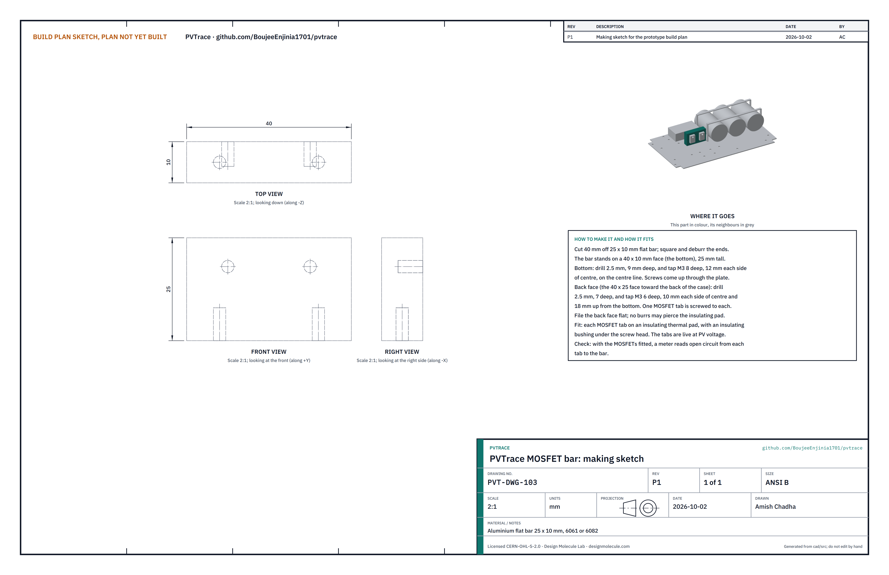

*Figure 9. MOSFET bar making sketch (PVT-DWG-103).*

**What it is and what it is made from.** A small aluminium bar that carries the load and discharge MOSFETs and spreads their heat. Aluminium flat bar 25 x 10 mm, 6061 or 6082 class.

**How to make it.**

1. Cut 40 mm off the bar; square and deburr the ends. It stands on a 40 x 10 mm face, 25 mm tall.
2. Bottom face: on the centre line, 12 mm each side of centre, drill 2.5 mm 9 deep and tap M3 8 deep.
3. Back face (the 40 x 25 face toward the back of the case): 10 mm each side of centre and 18 mm up from the bottom, drill 2.5 mm 7 deep and tap M3 6 deep.
4. File the back face flat so no burr can pierce the insulating pads.

**How it fits the parts next to it.**

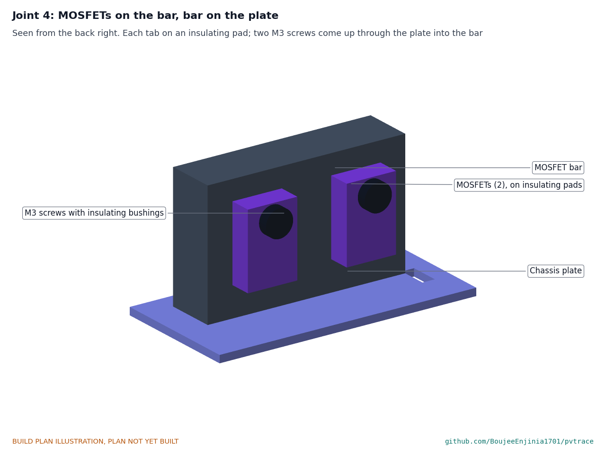

*Figure 10. Each MOSFET tab sits on an insulating thermal pad, screwed to the bar through an insulating bushing.*

The MOSFET tabs are live at module voltage; the pad and bushing keep them off the bar. Two M3 screws come up through the plate into the bar's bottom.

**Check before moving on.** With both MOSFETs fitted, a meter reads open circuit from each tab to the bar.

### 3.4 Parts on the plate

**What they are.** The discharge resistor (22 ohm, 50 W, aluminium clad), the fuse holder with its 20 A fuse, the cell holder with the charger and boost modules, the measurement board, the isolation board and the three load capacitors. All are bought (section 3.11); the two boards are hand-wired on perfboard.

**How to fit them.**

1. Resistor, fuse holder and cell holder: two M3 screws each through the plate, nuts underneath (step 4). No cell in the holder and no fuse in the fuse holder yet.
2. Measurement board (44 x 56 mm, turned with its long side front to back) and isolation board (30 x 24 mm): each on four 6 mm nylon standoffs, M3 screws from under the plate (step 5).
3. Capacitors: lie each on a bed of neutral-cure silicone, pins toward the front, then pass two cable ties down through the slots, under the plate and round all three (step 6).

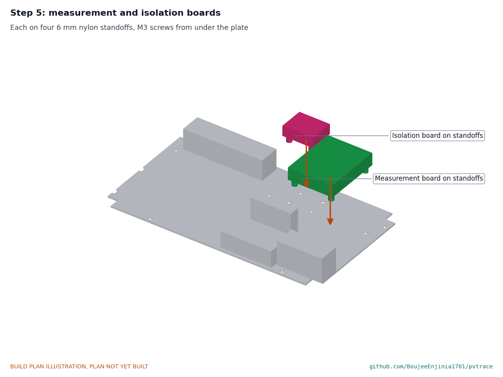

*Figure 11. Where the measurement and isolation boards go.*

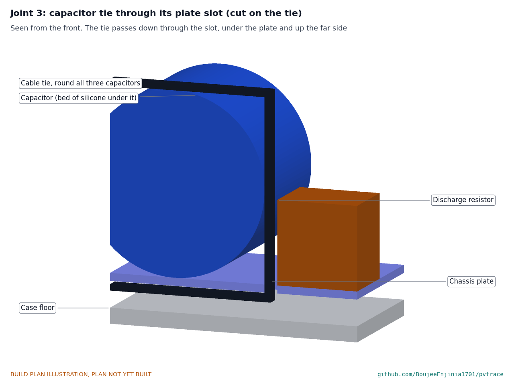

*Figure 12. Each tie passes down through a slot at one end of the bank, under the plate and up the other end.*

**Check before moving on.** Nothing on the plate rocks when pushed by hand; the capacitors cannot roll; the ties are pulled tight and trimmed flush.

#### 3.4.1 Wiring

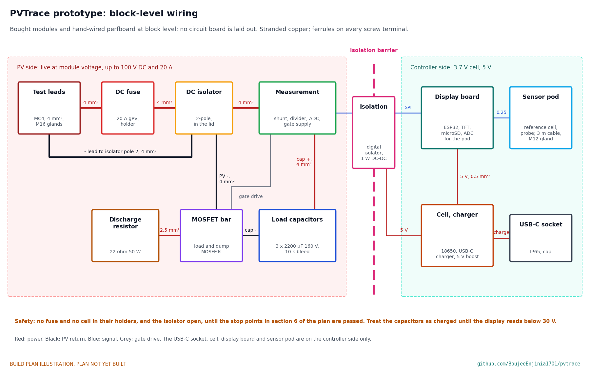

*Figure 13. Block-level wiring with wire sizes. No circuit board is laid out at this stage; bought modules and perfboard stand in for it.*

The isolation barrier divides the tracer in two. Everything on the PV side can be at module voltage; everything on the controller side stays at the cell's 3.7 V and 5 V. Only the isolation board crosses the line.

Wire it like this, with stranded copper, ferrules on every screw terminal and heat-shrink on every soldered joint:

1. Positive test lead through its gland to the fuse holder, then to pole 1 of the DC isolator: 4 mm².
2. Negative test lead through its gland to pole 2 of the DC isolator: 4 mm².
3. Isolator pole 1 to the measurement board's shunt, and from the shunt to the capacitors' positive pins: 4 mm².
4. Capacitors' negative pins to the load MOSFET, and the MOSFET to isolator pole 2: 4 mm².
5. Discharge MOSFET and discharge resistor across the capacitors, and the 10 kohm bleed resistor directly across the capacitors' pins: 2.5 mm².
6. Measurement board to the MOSFET gates: 0.25 mm², twisted with their returns.
7. Measurement board to the isolation board (signals and the isolated supply), and the isolation board to the display board: 0.25 mm².
8. Cell and charger to the isolation board and the display board: 0.5 mm², through the 5 V boost.
9. USB-C socket to the charger input: 0.5 mm².
10. Sensor pod cable through its gland to the display board's ADC module and the probe input: 0.25 mm².
11. The isolator and the display board are in the lid. Leave a 150 mm service loop on every lead to the lid so it can be laid beside the case open.

Keep the PV-side wires and the controller-side wires apart, at least 8 mm on the plate, and cross the barrier only at the isolation board.

**Check before moving on.** With no cell, no fuse and the isolator open: every wire continues end to end; the test leads read open to the USB-C socket shell; every wire is labelled.

### 3.5 Lid, cut and drilled, with the DC isolator

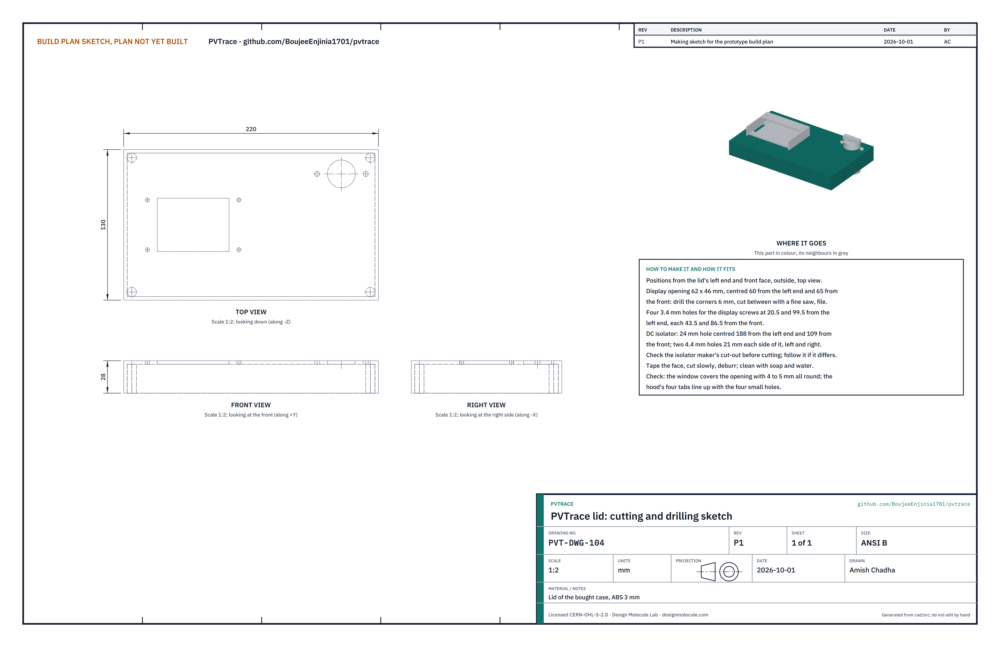

*Figure 14. Lid cutting and drilling sketch (PVT-DWG-104).*

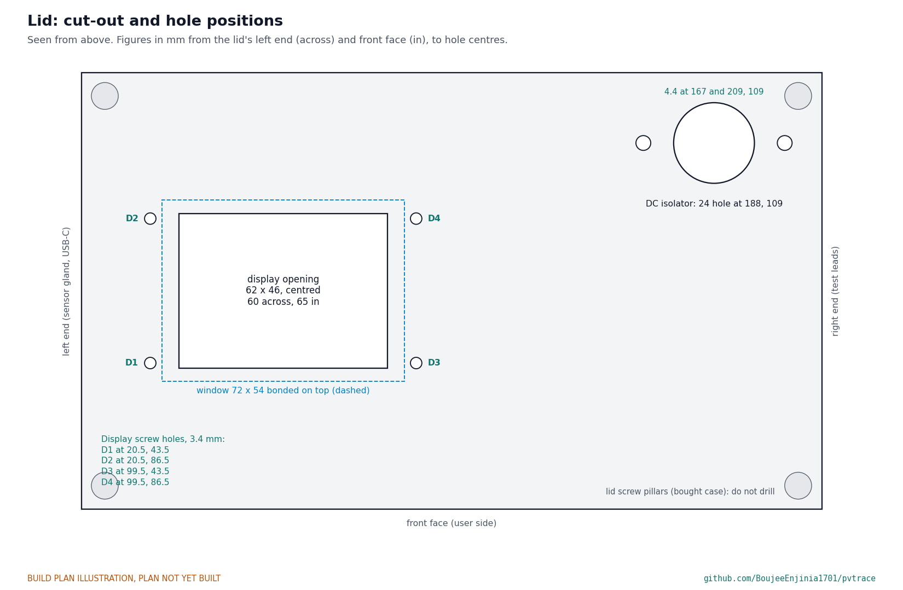

*Figure 15. The display opening, the four display screw holes and the isolator holes, measured from the left end and the front face.*

**What it is and what it is made from.** The case's own lid, 3 mm ABS, with a display opening and seven holes.

**How to make it.**

1. Tape the top. Mark the display opening, 62 x 46 mm, centred 60 mm from the left end and 65 mm from the front.
2. Drill a 6 mm hole in each corner of the opening, cut between them with a fine saw, and file the edges straight.
3. Drill the four 3.4 mm display screw holes at D1 to D4 in Figure 15.
4. DC isolator: a 24 mm hole centred 188 mm from the left end and 109 mm from the front, and two 4.4 mm holes 21 mm left and right of it. Check the isolator maker's cut-out drawing first and follow it if it differs.
5. Deburr, peel the tape and clean with soap and water.

**How it fits the parts next to it.**

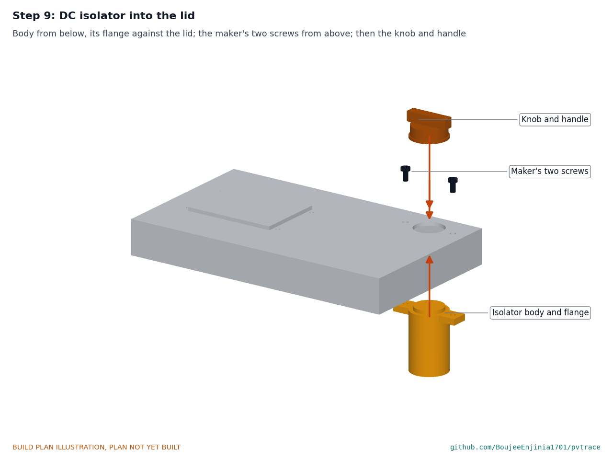

*Figure 16. The isolator body goes up from below until its flange meets the lid; the maker's two screws go down from above; then the knob and handle.*

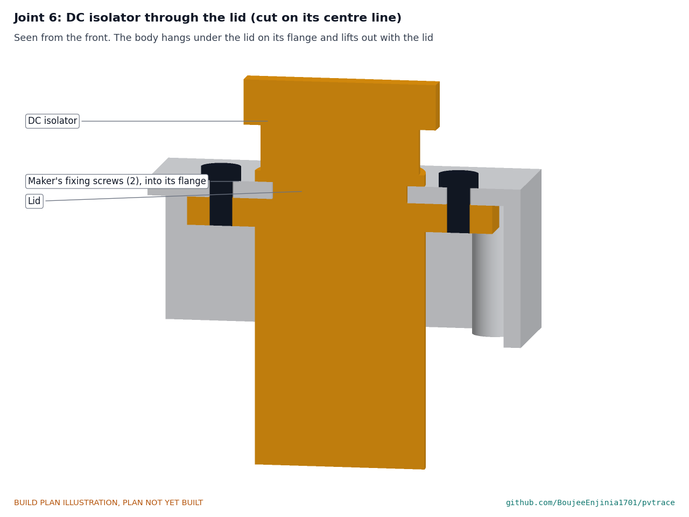

*Figure 17. The isolator hangs from the lid on its own flange and lifts out with the lid.*

**Check before moving on.** The isolator turns cleanly between its two positions; the lid closes on the body with the isolator 2.5 mm above the measurement board.

### 3.6 Window

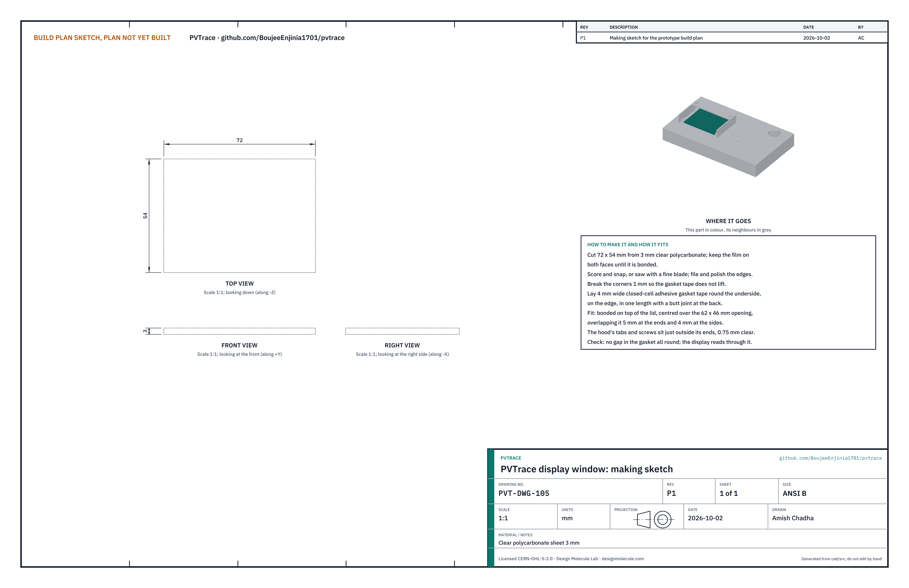

*Figure 18. Window making sketch (PVT-DWG-105).*

**What it is and what it is made from.** The clear cover over the display. Clear polycarbonate sheet 3 mm.

**How to make it.**

1. Cut 72 x 54 mm; keep the film on both faces until it is bonded.
2. File and polish the edges; break the corners 1 mm.
3. Lay 4 mm wide closed-cell adhesive gasket tape round the edge of the underside in one length, with the butt joint at the back.

**How it fits the parts next to it.** It is bonded on top of the lid, centred over the opening, overlapping it 5 mm at the ends and 4 mm at the sides (step 8). The display screws sit just outside its ends.

**Check before moving on.** The gasket is unbroken all round; the display can be read through the window.

### 3.7 Sun hood

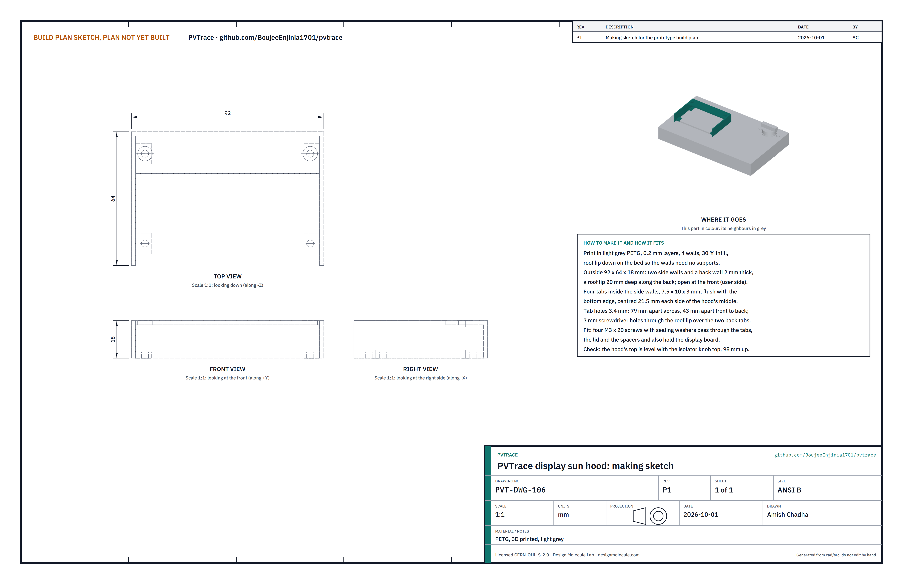

*Figure 19. Sun hood making sketch (PVT-DWG-106).*

**What it is and what it is made from.** A three-sided shade with a roof lip over the display, open toward the user. Light grey PETG, 3D printed.

**How to make it.**

1. Print with the roof lip down on the bed: 0.2 mm layers, 4 walls, 30 % infill. Outside 92 x 64 x 18 mm, walls 2 mm.
2. The four tabs inside the side walls, 7.5 x 10 x 3 mm, are flush with the bottom edge, with 3.4 mm holes 79 mm apart across and 43 mm apart front to back.
3. The roof lip has two 7 mm holes over the back tabs, so a screwdriver reaches those screws.

**How it fits the parts next to it.**

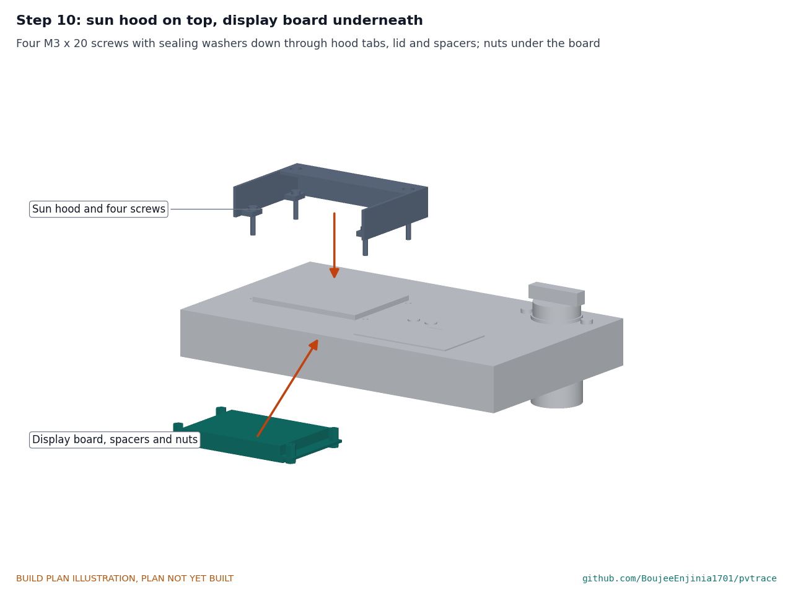

*Figure 20. Four M3 x 20 screws pass through the hood tabs, the lid and the spacers; nuts under the display board.*

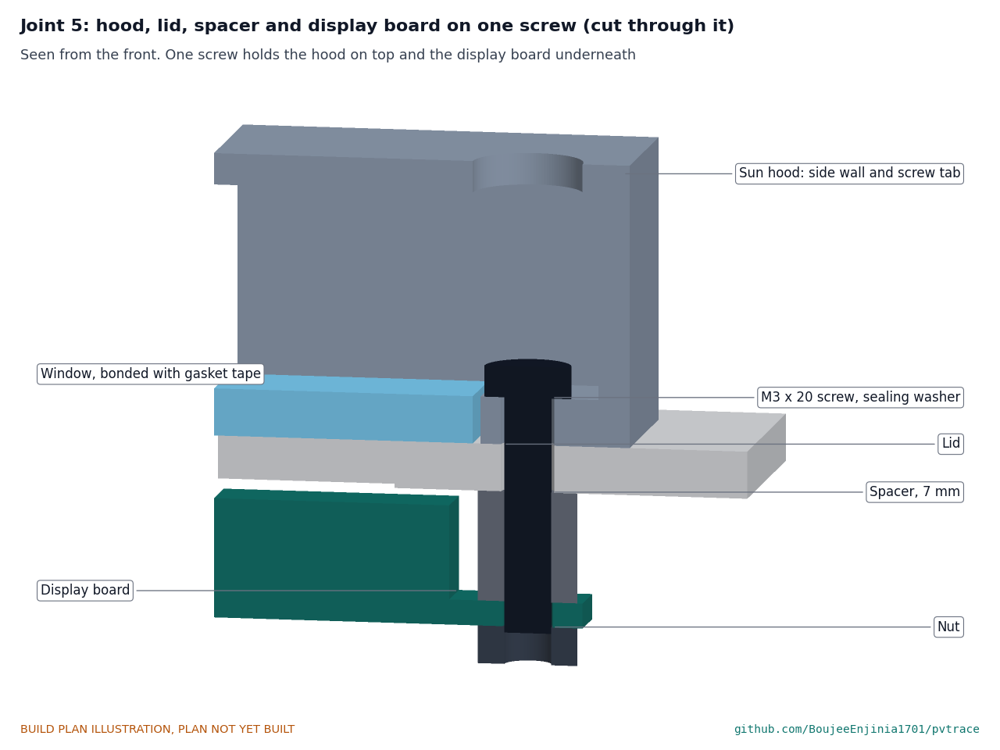

*Figure 21. One screw, with a sealing washer under its head, holds the hood on top and the display board underneath.*

The hood stands on the lid round the window. The display board, an 86 x 50 mm ESP32 board with a 2.8 in screen, hangs under the lid on four 7 mm spacers, its screen 1 mm below the lid and centred under the opening. Measure your board's holes before drilling the lid; the model assumes 79 x 43 mm between centres.

**Check before moving on.** The hood's top is level with the isolator knob, 98 mm above the bottom of the case; the display reads through the window with no gap at its edges.

### 3.8 Sensor pod housing

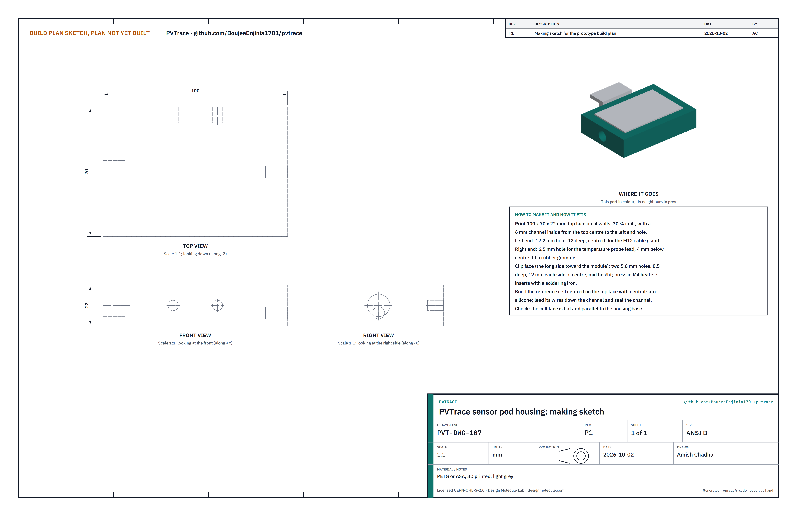

*Figure 22. Sensor pod housing making sketch (PVT-DWG-107).*

**What it is and what it is made from.** The block that carries the reference cell on its top face and the cable gland at its left end. Light grey PETG or ASA, 3D printed.

**How to make it.**

1. Print 100 x 70 x 22 mm, top face up, 4 walls, 30 % infill, with a 6 mm wiring channel inside from the centre of the top face to the left end hole.
2. Left end: 12.2 mm hole, 12 mm deep, centred, for the M12 cable gland. Right end: 6.5 mm hole 4 mm below centre for the temperature probe lead; fit a rubber grommet.
3. Clip face (the long side toward the module): two 5.6 mm holes, 8.5 mm deep, 12 mm each side of centre at mid height. Press in M4 heat-set inserts with a soldering iron.
4. Bond the reference cell centred on the top face with neutral-cure silicone; lead its wires down the channel and seal the channel with silicone.

**How it fits the parts next to it.** The clip screws to the clip face (section 3.9). The cable runs through the gland to the left end of the case.

**Check before moving on.** The cell face is flat and parallel to the housing base; the inserts are square to the face.

### 3.9 Sensor pod clip

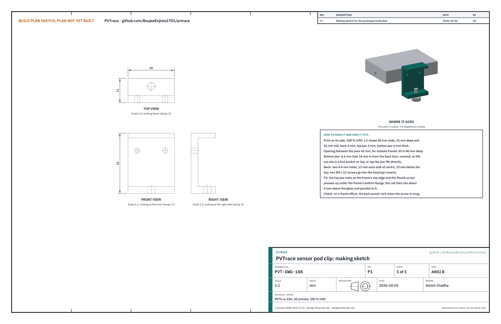

*Figure 23. Sensor pod clip making sketch (PVT-DWG-108).*

**What it is and what it is made from.** A C-shaped clamp that grips the edge of the module frame. PETG or ASA, 3D printed at 100 % infill.

**How to make it.**

1. Print on its side: 40 mm wide, 21 mm deep and 52 mm tall; back 6 mm, top jaw 4 mm and bottom jaw 6 mm thick; 42 mm between the jaws.
2. Bottom jaw: a 6.6 mm hole 14 mm in from the back face, centred. Tap it M6, or fit an M6 nut in a hex pocket on its top face.
3. Back: two 4.4 mm holes 12 mm each side of centre, 15 mm below the top.

**How it fits the parts next to it.**

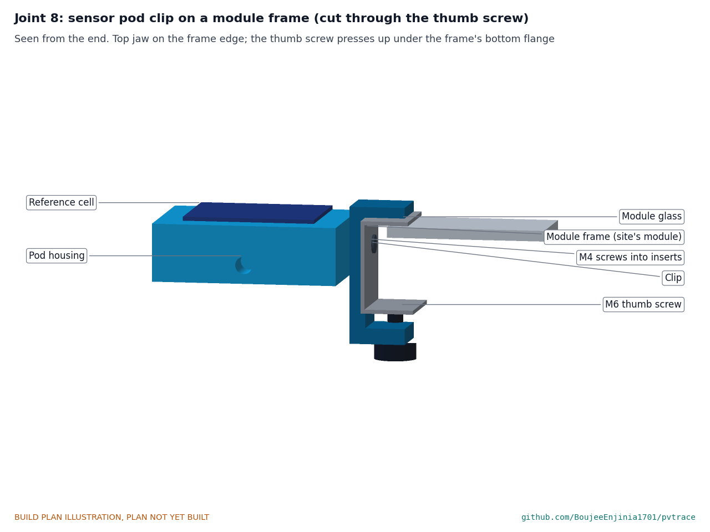

*Figure 24. The top jaw rests on the frame's top edge; the M6 thumb screw presses up under the frame's bottom flange.*

Two M4 x 12 screws hold the clip to the housing's inserts. On a frame 30 to 40 mm deep, the cell lies about 4 mm above the glass and parallel to it.

**Check before moving on.** On a frame offcut the pod cannot rock once the thumb screw is snug.

### 3.10 Sensor pod, assembled

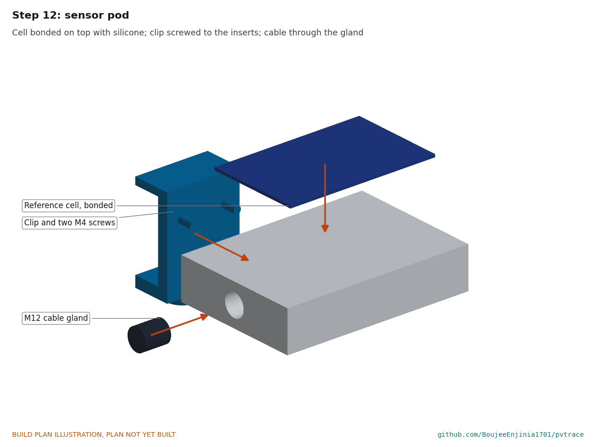

*Figure 25. Cell bonded on top, clip screwed to the inserts, cable through the gland.*

### 3.11 Bought components

Buy to specification, not brand. Line numbers are those of the bill of materials.

- **Case (line 1).** IP54 ABS, light grey, about 220 x 130 x 80 mm outside, lid on the large face screwing into four corner pillars, rubber corner bumpers, with two M16 and one M12 cable glands.
- **Display board (line 3).** ESP32 board 86 x 50 mm with a 2.8 in 320 x 240 screen and microSD socket (ESP32-2432S028 class), with an 8 GB card and a 16-bit I2C ADC module (ADS1115 class) for the reference cell.
- **Measurement board parts (line 4).** 4 milliohm 3 W four-terminal shunt, current-sense amplifier (INA240A2 class), 1 Mohm and 39 kohm 0.1 % divider, two-channel 12-bit 100 kS/s ADC (MCP3202 class), 4.096 V reference, protection diodes, perfboard 44 x 56 mm.
- **Load capacitors (line 5).** Three 2200 µF 160 V snap-in electrolytics, about 35 x 60 mm, 105 °C.
- **Switches (line 6).** Two 150 V N-channel MOSFETs, about 10 milliohm, TO-220, a gate driver, the 25 x 10 mm bar (section 3.3), insulating pads and bushings.
- **Resistors (line 7).** 22 ohm 50 W aluminium-clad resistor and a 10 kohm 3 W bleed resistor.
- **Fuse (line 8).** 20 A gPV 10 x 38 mm fuse rated 1,000 V DC, in a DC-rated holder no more than 44 x 20 mm on its base.
- **DC isolator (line 9).** Two-pole, 20 A at 250 V DC or more, panel mounting through a hole of about 24 mm with a flange under the panel, body no deeper than 47 mm below the lid.
- **Cell and charger (line 10).** Protected 18650 lithium-ion cell of about 3,000 mAh from a maker that publishes a datasheet; holder; USB-C charger with a temperature cut-off; 5 V boost; protection board.
- **Test leads (line 11).** Two 1 m lengths of 4 mm² double-insulated PV cable, red and black, with brand-matched MC4 connectors from one maker.
- **Sensor pod parts (line 12).** Encapsulated mono-Si reference cell about 80 x 50 mm with its shunt, waterproof DS18B20 probe with a foam shade, M12 cable gland, M6 thumb screw, two M4 heat-set inserts, 3 m cable with a connector.
- **Isolation barrier (line 14).** Four-channel digital isolator (ISO7741 or ADuM1401 class) and a 1 W isolated 5 V to 5 V converter on perfboard 30 x 24 mm.
- **USB-C socket (line 17).** Panel mounting, IP65 or better, tethered cap, M16 thread with locknut, 0.3 m lead.
- **Fixings and consumables (line 13).** Five M3 x 5 mm hex nylon standoffs with five M3 x 5 countersunk and five M3 x 4 pan-head screws; four M3 x 20 pan-head screws with sealing washers and nuts, four 7 mm spacers; M3 x 8 screws and nuts for the holders and resistor; eight 6 mm nylon standoffs; two 200 mm cable ties; neutral-cure silicone; 4 mm closed-cell adhesive gasket tape; wire in 4, 2.5, 0.5 and 0.25 mm², ferrules, heat-shrink, labels.

## 4. Putting it together

In each picture the parts already fitted are grey and the part being fitted is in colour, with an arrow showing the way it goes in. Steps 3 to 6 are done on the bench with the plate out of the case.

### Step 1: standoffs into the case floor

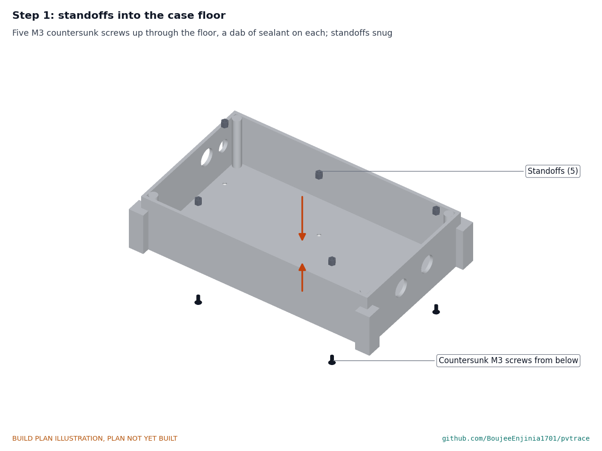

Five M3 countersunk screws up through the floor into the standoffs, with a dab of sealant on each screw. Snug, not tight; the floor is plastic.

### Step 2: glands and USB-C socket into the ends

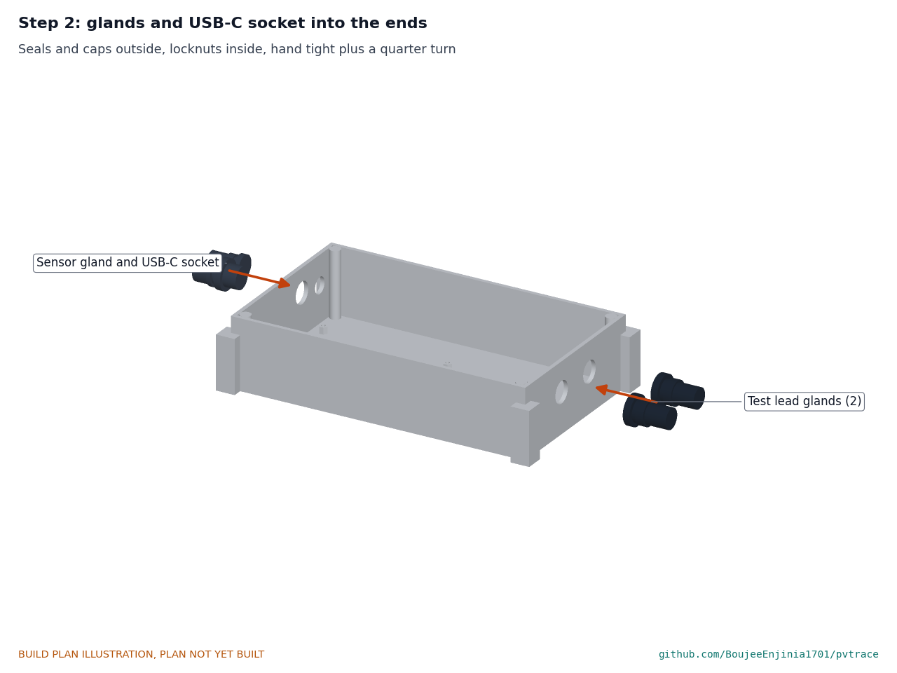

Seals and caps outside, locknuts inside, hand tight plus a quarter turn. Pass the test leads through their glands now and leave about 150 mm inside; do not tighten the gland caps yet.

### Step 3: MOSFETs onto the bar, bar onto the plate

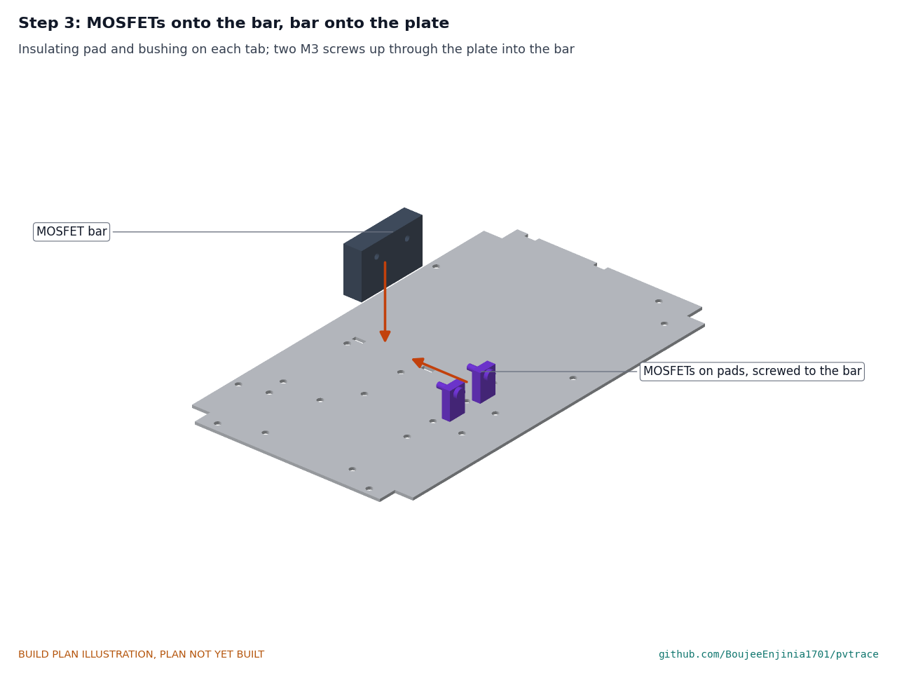

Each MOSFET on an insulating pad with an insulating bushing under its M3 screw. Then two M3 screws up through the plate into the bar. **Hold point:** each tab reads open circuit to the bar.

### Step 4: discharge resistor, fuse holder and cell holder

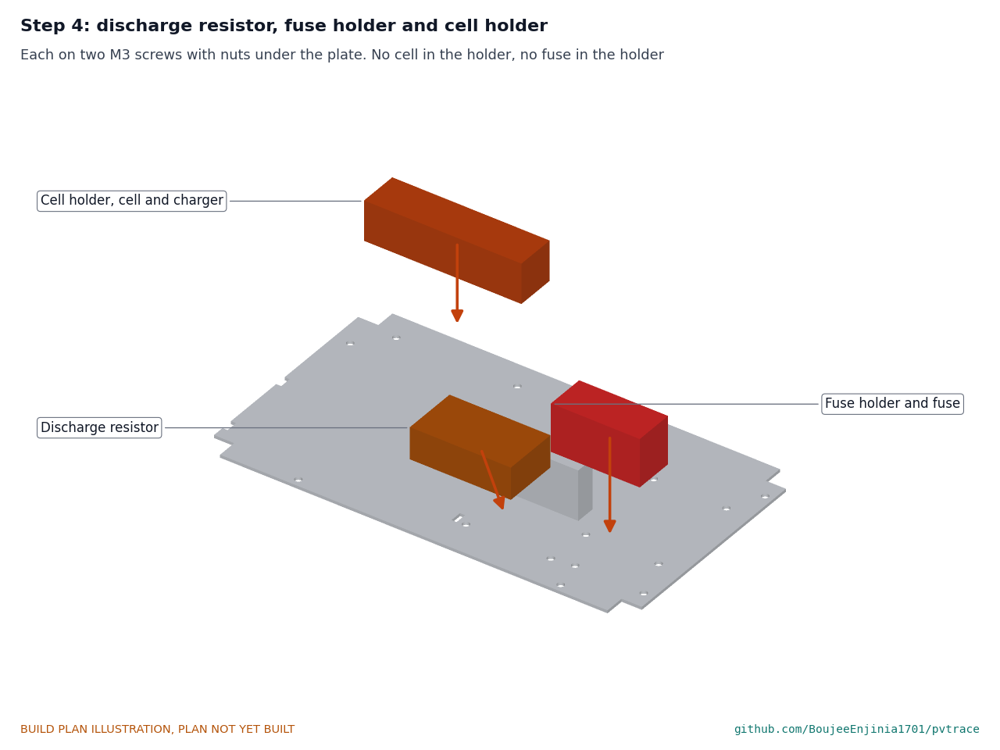

Two M3 screws each, nuts under the plate. Leave the fuse out of the fuse holder and the cell out of its holder.

### Step 5: measurement and isolation boards

Each on four 6 mm nylon standoffs, M3 screws from under the plate.

### Step 6: capacitors and their ties

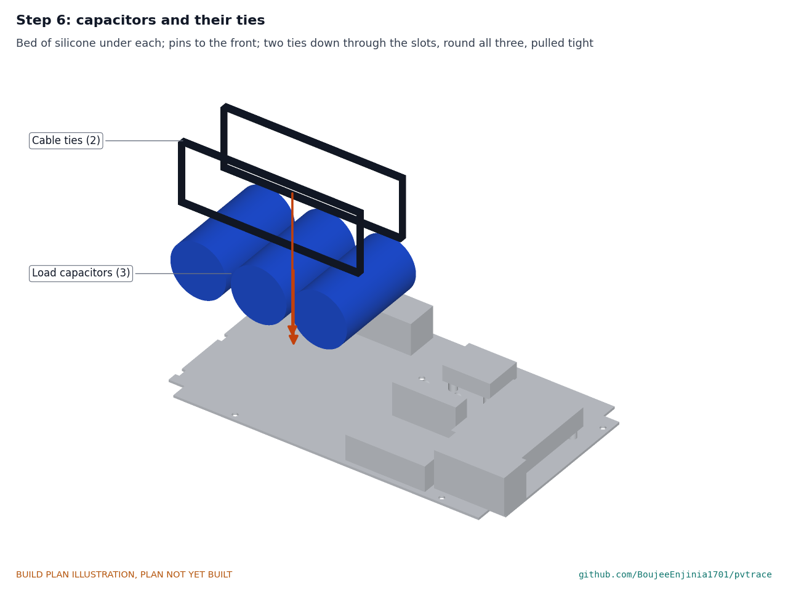

A bed of silicone under each capacitor, pins toward the front. Two cable ties down through the slots, under the plate and round all three, pulled tight. Let the silicone cure before moving the plate.

### Step 7: plate into the case

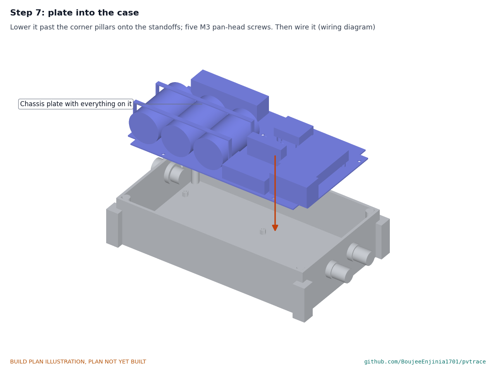

Lower the plate past the corner pillars onto the standoffs and fit the five M3 pan-head screws. Then wire everything in the body as section 3.4.1 says and tighten the gland caps on the leads and the sensor cable.

### Step 8: window onto the lid

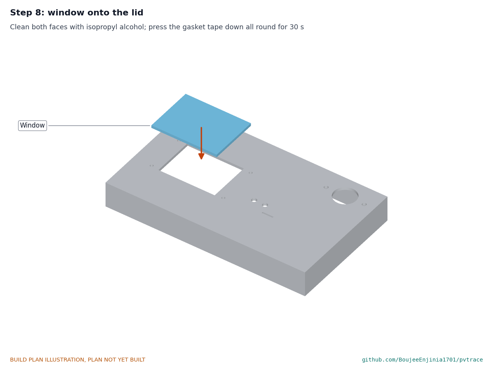

Clean the lid and the window with isopropyl alcohol. Peel the film from the underside, centre the window over the opening and press the gasket tape down all round for 30 seconds. Peel the top film last.

### Step 9: DC isolator into the lid

The body up from below until its flange meets the lid; the maker's two screws down from above; then the knob and handle. Set it to open (OFF).

### Step 10: sun hood on top, display board underneath

Hold the display board and its four spacers under the lid, screen up, and set the hood on top. Four M3 x 20 screws with sealing washers go down through the hood tabs, the lid and the spacers; nuts under the board. Use the holes in the roof lip for the two back screws.

### Step 11: close the case

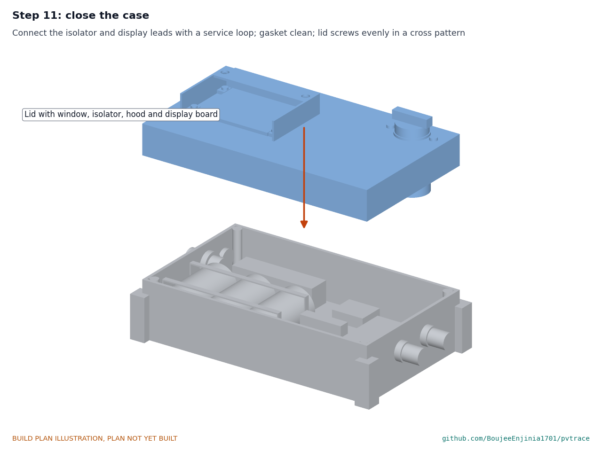

Connect the isolator and display board leads to the body with their service loops. Check the gasket is clean and no wire lies across it. Close the lid and tighten its screws evenly in a cross pattern. **Hold point:** safety stop S2 in section 6.

### Step 12: sensor pod

Bond the cell on top with silicone and let it cure. Screw the clip to the inserts with two M4 x 12 screws, fit the thumb screw, and pass the cable through the gland. Plug the cable into the case's sensor lead.

## 5. First checks

These are the checks a TRL 4 test report would record; this plan only lists them. Requirement numbers are those of PVT-REQ-001.

*Table 2. First checks.*

| Check | Requirement | How | Pass when |
| --- | --- | --- | --- |
| Isolation | R11, isolation design | Insulation tester at 500 V DC between the two test leads joined together and the USB-C socket shell, isolator closed, no cell | Above 100 Mohm |
| MOSFET tabs | R11 | Meter from each MOSFET tab to the bar | Open circuit |
| Polarity and over-voltage refusal | R1, R11 | Bench supply, current limit 0.5 A: reversed leads, then 30 V, then a supply set above the over-voltage threshold in firmware | Refuses reversed polarity and over-voltage; the load never connects |
| Sweep on a bench | R3, R4 | Bench supply at 30 V, current limit 2 A, behind a 3 ohm 50 W resistor in place of a module | Sweep time and pair count match the calculation for that source |
| Discharge | R11 | Charge to 30 V on the bench supply, sweep, time the fall with a meter on the capacitor pins; then with the controller off, time the passive fall | Below 30 V within 2 s; passive fall follows the 10 kohm bleed |
| Opening current | R11 | Current trace at the end of a bench sweep | The load switch opens below 0.5 A |
| Charging | R14 | USB-C charger into the socket, case closed, isolator open | Charge current flows; the charger stops at full charge and below its temperature limit |
| Battery life | R14 | Sweep every 20 s from full charge | 8 h or 200 sweeps |
| Seal | R13 | Look at the window gasket, gland seals and lid gasket under a lamp | Every seal evenly squeezed, no gaps (the spray test comes later) |
| Mass and size | R12 | Weigh with leads and pod; measure over bumpers, knob and hood | 1.5 kg or less (1.49 kg estimated); 250 x 150 x 100 mm or less |
| Pod clip | R7 | Clip to frames 30 and 40 mm deep; angle finder on the cell and on the glass | No rocking; the cell within 1 degree of the glass |

## 6. Safety stops

Stop at each point. Carry on only when everything listed is true.

- **S1. Before the cell comes into the workshop.** Cell voltage about 3.0 to 4.2 V; no swelling, dents or leaks; a datasheet from its maker. A charging spot ready on a non-flammable surface (ceramic tile or steel tray) with a fire extinguisher for electrical fires within reach.
- **S2. Before the fuse goes in or the isolator is closed.** With no cell and the isolator open: the isolation check of section 5 passes; each MOSFET tab reads open to the bar; the 10 kohm bleed reads across the capacitor pins; the capacitors read below 1 V.
- **S3. Before the cell goes in.** The cell holder polarity matches the protection board, checked with a meter, not by wire colour; the charger's temperature cut-off is fitted and not bypassed.
- **S4. Before any source is connected to the test leads.** Bench supply only, current limit 2 A or less, voltage 30 V or less. The polarity, discharge and opening current checks of section 5 pass on the bench before the next stop.
- **S5. Before the first connection to a real module.** Use a small 36-cell module first (about 22 V). Mate and unmate the MC4 connectors only with the isolator open, never under load, and use brand-matched connectors from one maker. Gloves and eye protection.
- **S6. Before modules above 50 V or two modules in series.** The over-voltage refusal works at the bench; the string's cold open-circuit voltage is below 100 V. Never connect to a string of an installed system unless the owner has isolated it from the inverter.
- **S7. Before the case is opened.** Leads disconnected; isolator open; the display reads below 30 V; wait 60 s; a meter on the capacitor pins reads below 30 V before any hand goes inside.
- **S8. Charging.** Isolator open, in shade, on the charging spot, attended, between 0 and 45 °C. Never leave the tracer charging in a hot vehicle.

## 7. Tools, skills and workspace

**Tools.** Bench drill or a drill in a stand; drills 2 to 6.6 mm; step drill to 20 mm; countersink; M3 and M6 taps and tap wrench; hacksaw and fine-tooth saw; flat and needle files; deburring tool; steel rule, square, calipers and scriber; masking tape; 3D printer with a bed of at least 100 x 100 mm that prints PETG; soldering iron with a heat-set insert tip; wire strippers, ferrule crimper and heat gun; multimeter; bench power supply with an adjustable current limit (0 to 30 V, 0 to 3 A); a 3 ohm 50 W resistor for bench sweeps; an insulation tester with a 500 V range (borrowed is fine); scale to 2 kg; angle finder.

**Skills.** No certified trade is needed for the build. Basic drilling, tapping and filing; 3D printing; through-hole soldering and crimping; safe use of a bench supply; care with lithium cells. The first connection to a live module (stop S5) should be made by, or with, someone who has worked safely on PV systems before; modules are live in light and cannot be switched off.

**Workspace.** A bench about 1.2 x 0.6 m with good light; the drilling corner kept apart from the electronics so swarf stays off the boards; a ventilated place for the printer; the charging spot of S1; and for stop S5, a shaded outdoor bench next to the module, with the module flat on the ground or on a low stand.

**Personal protective equipment.** Safety glasses for drilling, cutting and soldering; gloves when handling module frames and glass; no gloves near a turning drill.

## 8. Where the numbers come from

- Model and constructability checks: `cad/src/model.py` (`python cad/src/model.py --check`, 183 checks); STEP and STL exports in `cad/step/` and `cad/stl/`.
- Pictures: `cad/src/build_plan_media.py`, using `.kit/build_views.py`; written to `docs/05-build-plan/` and `cad/drawings/PVT-DWG-101` to `PVT-DWG-108`.
- General arrangement: `cad/drawings/PVT-DWG-001.pdf`, Rev P3.
- Calculations: `docs/04-calcs/01-sizing.md` (PVT-CAL-001 v0.3) and `docs/04-calcs/sizing.py`: sweep, discharge, heat, battery, mass and cost.
- Bill of materials: `bom/bom.csv`.
- Decisions: `docs/decisions/0003-design-for-construction.md` (PVT-DDR-003), with PVT-DDR-001 and PVT-DDR-002; the design decisions register `docs/06-design-decisions.md` (PVT-DEC-001).
- Requirements: `docs/03-requirements.md` (PVT-REQ-001 v0.5).
